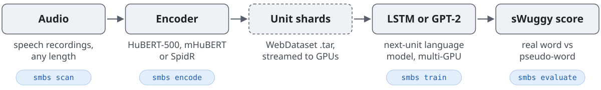
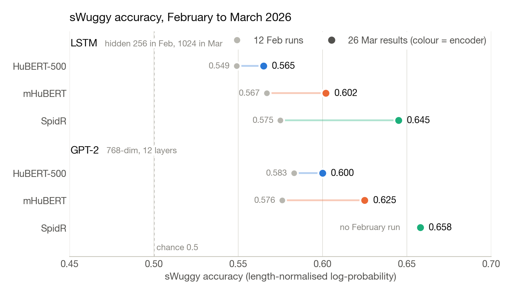

<h1 align="center">SMBS</h1>
<p align="center"><b>Speech Model Benchmarking Suite. Audio in, discrete units, a language model, a score.</b></p>
<p align="center"> <a href="LICENSE"></a> </p>

A speech language model learns from sound the way a text model learns from words: the audio is turned into a sequence of discrete units, and a language model learns to predict the next one. Whether it has learned anything like words is measured by sWuggy: shown a real word and a matched pseudo-word, does the model prefer the real one? SMBS is one command-line tool for the whole loop. It encodes audio into units with any of three encoders, trains an LSTM or a GPT-2 on them across several GPUs from streamed shards, and scores the result, so that every model in the lab is trained and judged the same way. Built at the Cognitive Machine Learning lab at ENS Paris.

<p align="center"><picture><source media="(prefers-color-scheme: dark)" srcset="docs/figures/pipeline-dark.svg"></picture></p>

## Results so far

<p align="center"></p>
<p align="center"><sub>sWuggy accuracy, chance is 0.5. Six weeks of the same suite: the first runs sat between 0.55 and 0.58; the best model now, a GPT-2 on SpidR units, reaches 0.66. Every point was trained and scored by the same command.</sub></p>

## What the suite settled

- **One recipe per model family.** Thirty-odd short LSTM runs sat on a loss plateau near 5.1 until a smaller model at a hundred times the learning rate, with gradient clipping and no weight decay, converged within 40 steps. `smbs grid` reruns that recipe against the published one, one factor at a time, and the runs that found it are documented in [docs/training_notes.md](docs/training_notes.md).
- **Streaming, not loading.** Unit shards are streamed to every GPU worker, each drawing shards at random from the corpus, so a run's memory footprint does not grow with the corpus.
- **Encoders are interchangeable.** Swapping HuBERT for SpidR is a flag; the training and scoring code does not change.

## Use it

After `uv sync` and `smbs scan /path/to/audio` (which writes the file manifest), each step is one command. Each submits a SLURM job; add `--local` to run it on the current machine.

```bash
# audio → unit shards
smbs encode --encoder spidr_base --dataset chunks30
# train a unit language model (or --arch lstm)
smbs train --encoder spidr_base --arch gpt2
# encode the sWuggy audio, once per encoder
smbs prepare-swuggy --encoder spidr_base --parquet-pattern '/path/to/swuggy/*.parquet'
# score a trained model
smbs evaluate --encoder spidr_base --model gpt2_e768_l12_h12_feb12
```

The evaluation ends with a summary in this format (value shown: GPT-2 on SpidR units, from the March results, to three decimals):

```
  Normalized: 0.658
```

Raw and length-normalised accuracy are both printed, with a per-voice breakdown. Full options, the evaluation schema for other lexical benchmarks, and the project layout are in [docs/USAGE.md](docs/USAGE.md).

## Scope and credit

- Training audio is LibriVox audiobooks, public domain. sWuggy follows the Zero Resource Speech Benchmark definition.
- Encoders: HuBERT and mHuBERT (Meta), SpidR (Meta). GPT-2 via Hugging Face.
- Pairs with [DL++](https://github.com/danieldager/DLplusplus), which produces training shards from daylong child recordings.

Issues and pull requests are welcome.
